# modelXchange Schema

This repository currently contains a JSON Schema derived from the Hugging Face model card template:

- Upstream reference: [modelcard_template](https://raw.githubusercontent.com/huggingface/huggingface_hub/refs/heads/main/src/huggingface_hub/templates/modelcard_template.md)
- Generated schema: `huggingface-modelcard.schema.json`
- Synapse extension component: `synapsemod.schema.json`
- Composed schema: `modelcard.schema.json`
- Minimal composed schema: `modelcardminimal.schema.json`
- Hugging Face standalone top-level modules: `modules/`
- Synapse registry script: `scripts/register_schema.py`
- PR workflow: `.github/workflows/main-ci.yml`

## Schema Visualization

Legend:

- Yellow: Hugging Face schema
- Teal: required reusable Hugging Face modules
- Gray: optional reusable Hugging Face modules
- Blue: `modelcard` composed schema
- Light blue: `modelcardminimal` composed schema
- Pink: Synapse extension component

```mermaid
flowchart TB
  hf["huggingface-modelcard.schema.json"]
  mc["modelcard.schema.json"]
  mcm["modelcardminimal.schema.json"]
  syn["synapsemod.schema.json"]

  model_details["modeldetails"]
  uses["uses"]
  bias["biasrisks"]
  getting_started["getstarted"]
  training["trainingdetails"]
  evaluation["evaluation"]
  environmental["environmentalimpact"]
  technical["technicalspecifications"]
  citation["citation"]
  glossary["glossary"]
  more_info["moreinformation"]
  authors["modelcardauthors"]
  contact["modelcardcontact"]

  hf --> model_details
  hf --> uses
  hf --> bias
  hf --> getting_started
  hf --> training
  hf --> evaluation
  hf --> environmental
  hf --> technical
  hf --> citation
  hf --> glossary
  hf --> more_info
  hf --> authors
  hf --> contact

  mc --> hf
  mc --> syn

  mcm --> model_details
  mcm --> uses
  mcm --> bias
  mcm --> getting_started
  mcm --> training
  mcm --> evaluation
  mcm --> environmental
  mcm --> contact
  mcm --> syn

  classDef root fill:#1f2937,stroke:#0f172a,color:#f8fafc;
  classDef hf fill:#facc15,stroke:#ca8a04,color:#0f172a;
  classDef modelcard fill:#017fa5,stroke:#015a75,color:#f8fafc;
  classDef modelcardminimal fill:#7fc6da,stroke:#017fa5,color:#0f172a;
  classDef required fill:#469285,stroke:#2f6d62,color:#f8fafc;
  classDef optional fill:#bbbbbc,stroke:#7a7a7b,color:#0f172a;
  classDef synapse fill:#fce7f3,stroke:#be185d,color:#0f172a;

  class hf hf;
  class mc modelcard;
  class mcm modelcardminimal;
  class model_details,uses,bias,getting_started,training,evaluation,environmental,contact required;
  class technical,citation,glossary,more_info,authors optional;
  class syn synapse;
```

