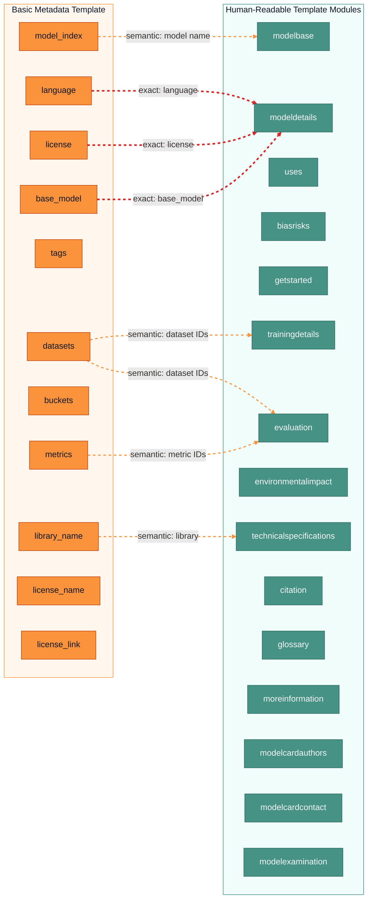

# Template Comparison: Basic Metadata vs. Human-Readable

The basic metadata template (`hub-docs/modelcard.md`) defines YAML frontmatter fields, while the human-readable template (`modelcard_template.md`) defines the prose sections of a model card. The schemas below capture both.

- **Basic metadata schema**: `hf-basic-metadata.schema.json`
- **Human-readable schema**: `modelcard.schema.json` (composed from modules)

## Property Overlap

| Basic Metadata | Human-Readable Module | Overlap |
|---|---|---|
| `language` | `modeldetails.language` | Exact — same array-of-strings field |
| `license` | `modeldetails.license` | Exact — same string field |
| `base_model` | `modeldetails.base_model` | Exact — same model identifier(s) |
| `model_index[].name` | `modelbase.model_id` | Semantic — both name the model |
| `datasets` | `trainingdetails.training_data`, `evaluation.testing_data` | Semantic — structured IDs vs. free text |
| `metrics` | `evaluation.testing_metrics`, `evaluation.results` | Semantic — metric IDs vs. free-text results |
| `model_index[].results.task.type` | `modeldetails.model_type` | Semantic — task category vs. model family |
| `library_name` | `technicalspecifications.software` | Semantic — specific library vs. full software stack |

## Overlap Visualization

Legend:

- Orange: basic metadata template (YAML frontmatter)
- Teal: human-readable template modules
- Red dashed lines: exact property overlaps (same field)
- Orange dashed lines: semantic overlaps (related concepts)



## Fields Unique to the Basic Metadata Template

These fields exist only in the basic metadata template and have **no counterpart** in the human-readable template modules:

| Field | Type | Description |
|---|---|---|
| `tags` | `array[string]` | Free-form classification tags (e.g. `audio`, `speech`) |
| `buckets` | `array[string]` | Storage bucket references (e.g. `my-org/my-bucket`) |
| `license_name` | `string` | Custom license ID when `license = "other"` |
| `license_link` | `string` | Path/URL to custom license file |

The `license_name` and `license_link` fields have been factored into a standalone module: `modelxchange-license.schema.json`.

## Evaluation: `model_index` (Basic) vs. Evaluation Module (Human-Readable)

Both templates capture evaluation information, but they differ fundamentally in structure and purpose.

**Human-readable evaluation module** (`modelxchange-evaluation.schema.json`) uses five **free-text string fields** meant for prose descriptions:

| Field | Purpose |
|---|---|
| `testing_data` | Describe what data was used for evaluation |
| `testing_factors` | Describe what factors were considered |
| `testing_metrics` | Describe which metrics were used |
| `results` | Describe the evaluation results in detail |
| `results_summary` | Summarize the results |

All fields are required, all are plain strings with `[More Information Needed]` defaults. This is designed for a human audience reading the model card.

**Basic metadata `model_index`** is a **structured, machine-readable** array designed for automated consumption (leaderboards, Hub search, verification). Each entry nests:

```
model_index[]:
  name              <- model identifier
  results[]:
    task:
      type          <- enumerated task type (e.g. "automatic-speech-recognition")
      name          <- display name
    dataset:
      type          <- HF dataset ID (e.g. "common_voice")
      name          <- display name
      config        <- load_dataset() subset
      split         <- e.g. "test"
      revision      <- dataset commit hash
      args          <- additional load_dataset() kwargs
    metrics[]:
      type          <- metric ID (e.g. "wer")
      value         <- numeric result (e.g. 20.90)
      name          <- display name
      config        <- load_metric() configuration
      args          <- Metric.compute() kwargs
      verifyToken   <- HF-signed proof of evaluation provenance
    source:
      name          <- e.g. "Open LLM Leaderboard"
      url           <- link to source
```

**Key differences at a glance:**

| Dimension | Human-Readable (`evaluation`) | Basic Metadata (`model_index`) |
|---|---|---|
| Format | Free-text strings | Structured nested objects |
| Audience | Humans reading the card | Machines (Hub API, leaderboards) |
| Granularity | One blob per concern | Per-task, per-dataset, per-metric |
| Dataset refs | Prose description | HF dataset IDs + split/config/revision |
| Metric values | Prose description | Typed values with named metric IDs |
| Provenance | None | `verifyToken` for HF-signed results |
| Reproducibility | Implicit | Explicit `args`, `config`, `revision` |

In a combined schema, the evaluation module provides the **narrative context** (why these metrics, what factors matter) while `model_index` provides the **structured data** (exact scores, dataset versions, reproducibility metadata). They are complementary rather than redundant.
